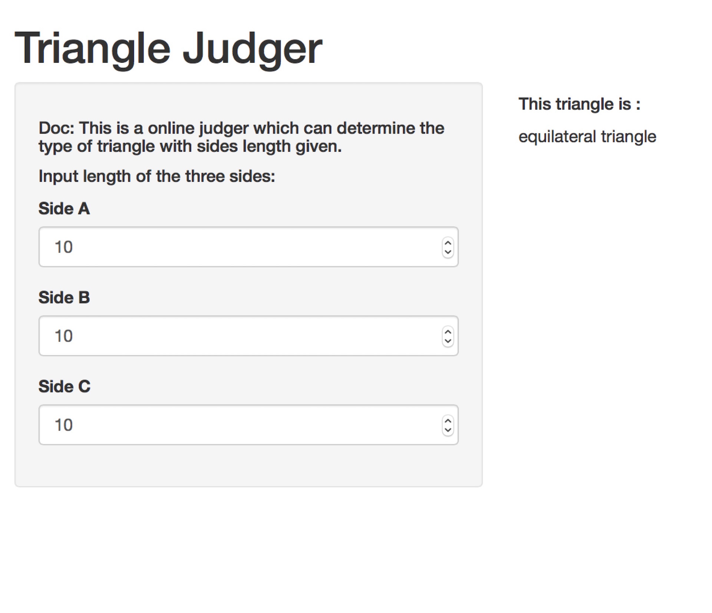
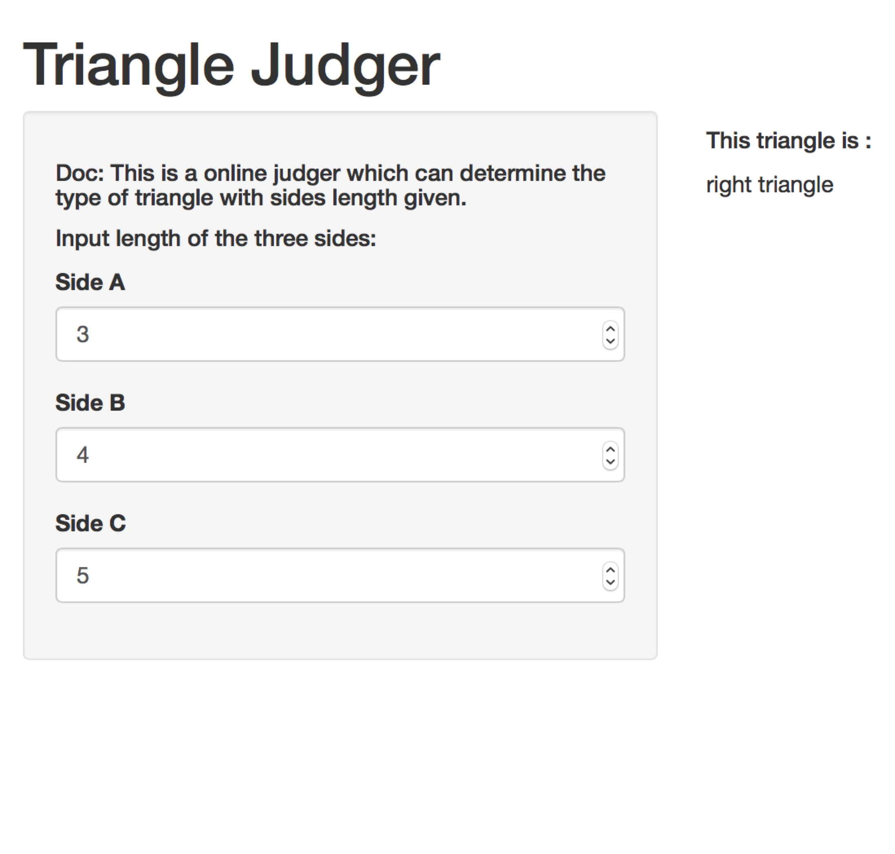

## App Introduction

According the course project of [Developing Data Products Course](https://www.coursera.org/learn/data-products) from Coursera, We create a small shiny app called `Triangle Judge`. It can determine the type of triangle with sides length given.

---
## Input & Output

Assume the triangle has three sides called `a`, `b`, `c`, our app has three inputs:

```rmd
1. a : length of side a
2. b : length of side b
3. c : length of side c
```
<br/>
With all the side length given, the app will take caculation and return one of the results below:
```Rmd
1. equilateral triangle
2. isosceles triangle
3. right triangle
4. normal triangle
5. Illegal Side Length
```

---
## Demo
Case 1 &nbsp;&nbsp;&nbsp;&nbsp;&nbsp;&nbsp;&nbsp;&nbsp;&nbsp;&nbsp;&nbsp;&nbsp;&nbsp;&nbsp;&nbsp;&nbsp;&nbsp;&nbsp;&nbsp;&nbsp;&nbsp;&nbsp;&nbsp;&nbsp;&nbsp;&nbsp;&nbsp;&nbsp;&nbsp;&nbsp;&nbsp;&nbsp;&nbsp;&nbsp;&nbsp;&nbsp;&nbsp;&nbsp;&nbsp;&nbsp;&nbsp;&nbsp;&nbsp;&nbsp;&nbsp;&nbsp;&nbsp;&nbsp;&nbsp;&nbsp;&nbsp;&nbsp;&nbsp;&nbsp;&nbsp;&nbsp;&nbsp;&nbsp;&nbsp;&nbsp;&nbsp;&nbsp;&nbsp;&nbsp;&nbsp;&nbsp;&nbsp;&nbsp;&nbsp;&nbsp;&nbsp; Case 2

&nbsp;&nbsp;&nbsp;&nbsp;


[Try it online](http://service.zhipet.com:3838/shiny/)

--- 
## Code
The core code is shown below: 
```{r setup, cache = T, echo = T, message = F, warning = F, tidy = F}
judgeTriangle <- function(a, b, c) {
  if (a>0 & b>0 & c>0 & a+b>c & a+c>b & b+c>a) {
    if(a==b & b==c) { "equilateral triangle"
    } else if(a==b | a==c | b==c) { "isosceles triangle"
    } else if(a*a+b*b==c*c | a*a+c*c==b*b | b*b+c*c==a*a) { "right triangle"
    } else { "normal triangle" }
  } else { "Illegal Side Length" }
}
```

Demo run:
```{r}
judgeTriangle(3, 4, 5)
```